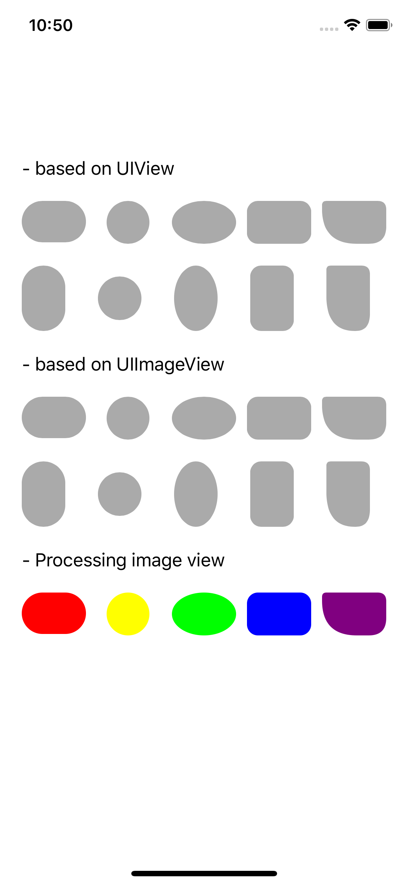
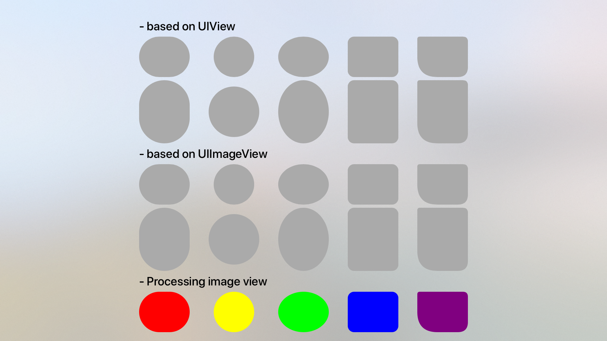

# MTKit (UIKit add-ons)

[](https://github.com/mntone/MTKit/blob/master/LICENSE.txt)





## Requirements

- iOS 8.0+ / tvOS 9.0+

## Installation

### CocoaPods

```
pod 'MTKit', :git => 'https://github.com/mntone/MTKit.git'
```

### Carthage

```
github "mntone/MTKit"
```


## LICENSE

[MIT License](https://github.com/mntone/MTKit/blob/master/LICENSE.txt)


## Author

mntone
- GitHub: https://github.com/mntone
- Twitter: https://twitter.com/mntone (Japanese)
